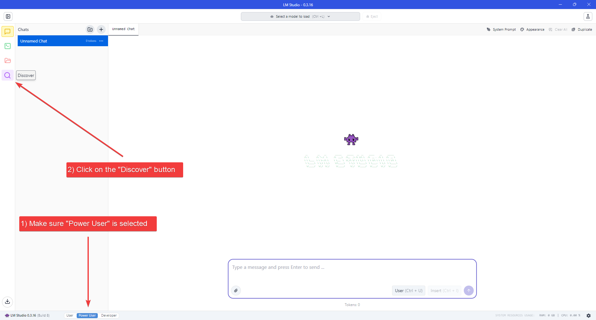
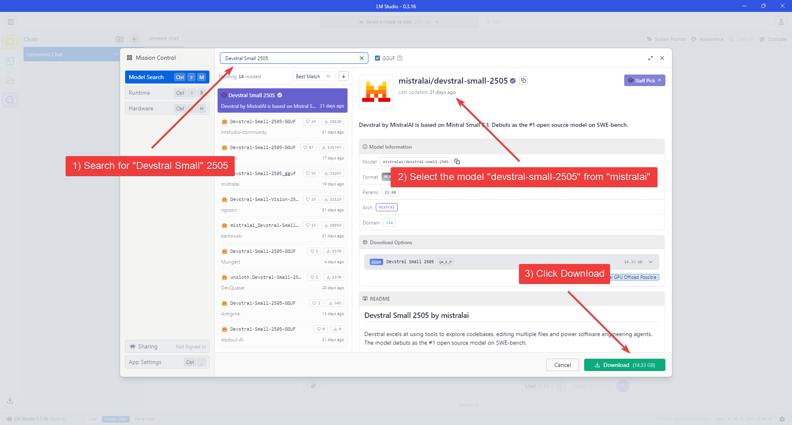
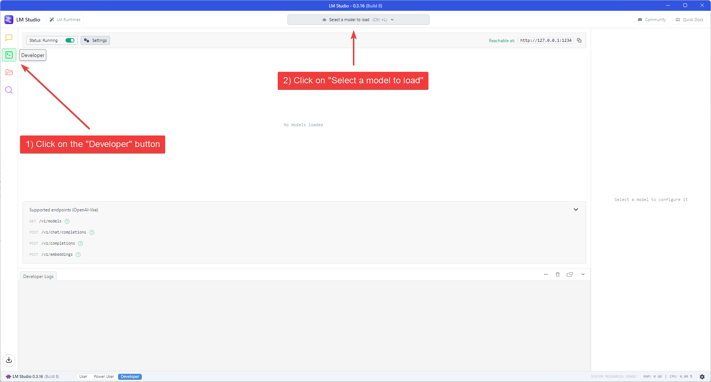
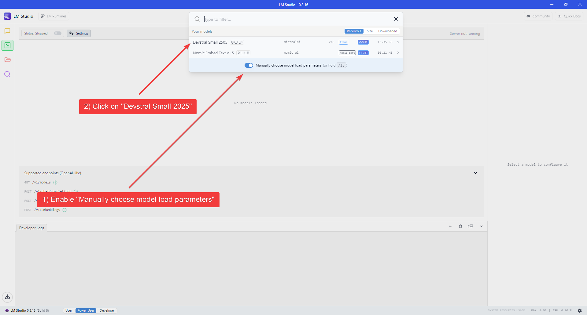
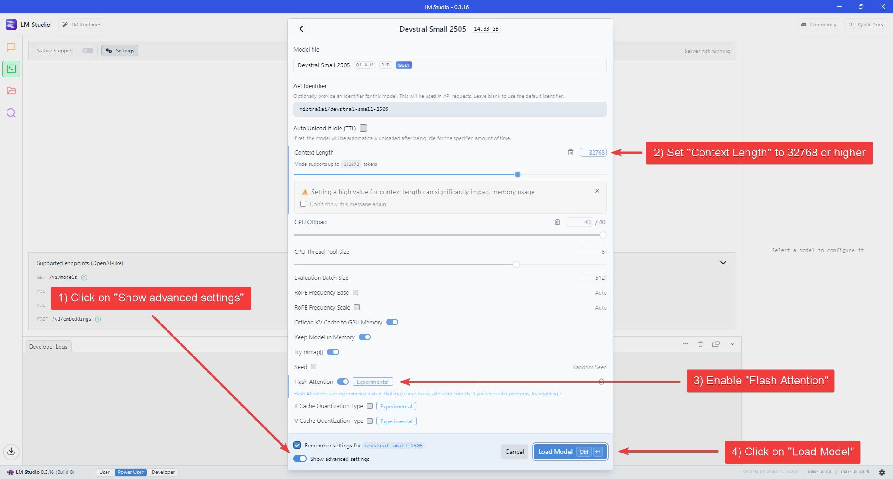
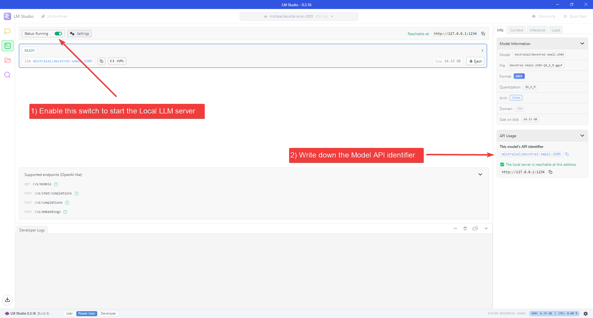
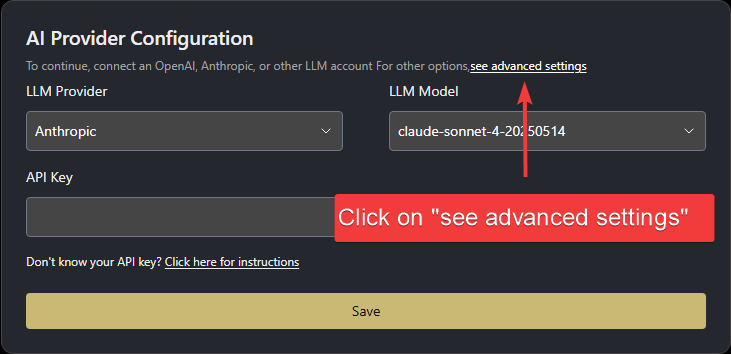
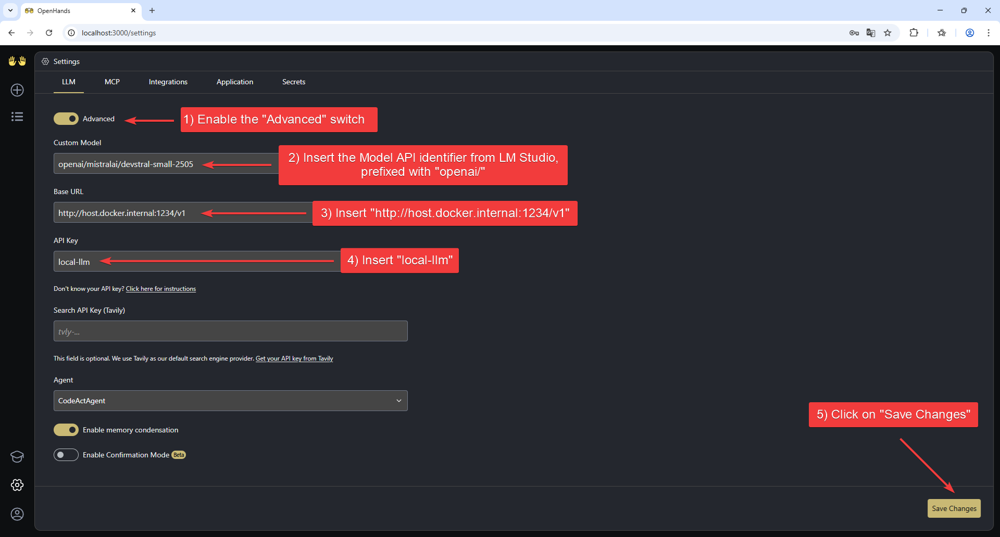

# Local LLMs

## Basic Usage

```python
from openhands.sdk import LLM

# For Ollama
llm = LLM(
    model="ollama/llama3.2",
    base_url="http://localhost:11434",
)

# For vLLM/SGLang
llm = LLM(
    model="openai/your-model-name",
    base_url="http://localhost:8000/v1",
)
```

# Local LLMs

## Basic Usage

```python
from openhands.sdk import LLM

# For Ollama
llm = LLM(
    model="ollama/llama3.2",
    base_url="http://localhost:11434",
)

# For vLLM/SGLang
llm = LLM(
    model="openai/your-model-name",
    base_url="http://localhost:8000/v1",
)
```

## News

- 2025/05/21: We collaborated with Mistral AI and released [Devstral Small](https://mistral.ai/news/devstral) that achieves [46.8% on SWE-Bench Verified](https://github.com/SWE-bench/experiments/pull/228)!
- 2025/03/31: We released an open model OpenHands LM 32B v0.1 that achieves 37.1% on SWE-Bench Verified
([blog](https://www.all-hands.dev/blog/introducing-openhands-lm-32b----a-strong-open-coding-agent-model), [model](https://huggingface.co/all-hands/openhands-lm-32b-v0.1)).

## Quickstart: Running OpenHands with a Local LLM using LM Studio

This guide explains how to serve a local Devstral LLM using [LM Studio](https://lmstudio.ai/) and have OpenHands connect to it.

We recommend:
- **LM Studio** as the local model server, which handles metadata downloads automatically and offers a simple, user-friendly interface for configuration.
- **Devstral Small 2505** as the LLM for software development, trained on real GitHub issues and optimized for agent-style workflows like OpenHands.

### Hardware Requirements

Running Devstral requires a recent GPU with at least 16GB of VRAM, or a Mac with Apple Silicon (M1, M2, etc.) with at least 32GB of RAM.

### 1. Install LM Studio

Download and install the LM Studio desktop app from [lmstudio.ai](https://lmstudio.ai/).

### 2. Download Devstral Small

1. Make sure to set the User Interface Complexity Level to "Power User", by clicking on the appropriate label at the bottom of the window.
2. Click the "Discover" button (Magnifying Glass icon) on the left navigation bar to open the Models download page.



3. Search for the "Devstral Small 2505" model, confirm it's the official Mistral AI (mistralai) model, then proceed to download.



4. Wait for the download to finish.

### 3. Load the Model

1. Click the "Developer" button (Console icon) on the left navigation bar to open the Developer Console.
2. Click the "Select a model to load" dropdown at the top of the application window.



3. Enable the "Manually choose model load parameters" switch.
4. Select 'Devstral Small 2505' from the model list.



5. Enable the "Show advanced settings" switch at the bottom of the Model settings flyout to show all the available settings.
6. Set "Context Length" to at least 32768 and enable Flash Attention.
7. Click "Load Model" to start loading the model.



### 4. Start the LLM server

1. Enable the switch next to "Status" at the top-left of the Window.
2. Take note of the Model API Identifier shown on the sidebar on the right.



### 5. Start OpenHands

1. Check [the installation guide](/usage/local-setup) and ensure all prerequisites are met before running OpenHands, then run:

2. Wait until the server is running (see log below):
```
Digest: sha256:e72f9baecb458aedb9afc2cd5bc935118d1868719e55d50da73190d3a85c674f
Status: Image is up to date for docker.all-hands.dev/all-hands-ai/openhands:0.56
Starting OpenHands...
Running OpenHands as root
14:22:13 - openhands:INFO: server_config.py:50 - Using config class None
INFO:     Started server process [8]
INFO:     Waiting for application startup.
INFO:     Application startup complete.
INFO:     Uvicorn running on http://0.0.0.0:3000 (Press CTRL+C to quit)
```

3. Visit `http://localhost:3000` in your browser.

### 6. Configure OpenHands to use the LLM server

Once you open OpenHands in your browser, you'll need to configure it to use the local LLM server you just started.

When started for the first time, OpenHands will prompt you to set up the LLM provider.

1. Click "see advanced settings" to open the LLM Settings page.



2. Enable the "Advanced" switch at the top of the page to show all the available settings.

3. Set the following values:
    - **Custom Model**: `openai/mistralai/devstral-small-2505` (the Model API identifier from LM Studio, prefixed with "openai/")
    - **Base URL**: `http://host.docker.internal:1234/v1`
    - **API Key**: `local-llm`

4. Click "Save Settings" to save the configuration.



That's it! You can now start using OpenHands with the local LLM server.

If you encounter any issues, let us know on [Slack](https://dub.sh/openhands) or [Discord](https://discord.gg/ESHStjSjD4).

## Advanced: Alternative LLM Backends

This section describes how to run local LLMs with OpenHands using alternative backends like Ollama, SGLang, or vLLM — without relying on LM Studio.

### Create an OpenAI-Compatible Endpoint with Ollama

- Install Ollama following [the official documentation](https://ollama.com/download).
- Example launch command for Devstral Small 2505:

```bash
# ⚠️ WARNING: OpenHands requires a large context size to work properly.
# When using Ollama, set OLLAMA_CONTEXT_LENGTH to at least 32768.
# The default (4096) is way too small — not even the system prompt will fit, and the agent will not behave correctly.
OLLAMA_CONTEXT_LENGTH=32768 OLLAMA_HOST=0.0.0.0:11434 OLLAMA_KEEP_ALIVE=-1 nohup ollama serve &
ollama pull devstral:latest
```

### Create an OpenAI-Compatible Endpoint with vLLM or SGLang

First, download the model checkpoints. For [Devstral Small 2505](https://huggingface.co/mistralai/Devstral-Small-2505):

```bash
huggingface-cli download mistralai/Devstral-Small-2505 --local-dir mistralai/Devstral-Small-2505
```

#### Serving the model using SGLang

- Install SGLang following [the official documentation](https://docs.sglang.ai/start/install.html).
- Example launch command for Devstral Small 2505 (with at least 2 GPUs):

```bash
SGLANG_ALLOW_OVERWRITE_LONGER_CONTEXT_LEN=1 python3 -m sglang.launch_server \
    --model mistralai/Devstral-Small-2505 \
    --served-model-name Devstral-Small-2505 \
    --port 8000 \
    --tp 2 --dp 1 \
    --host 0.0.0.0 \
    --api-key mykey --context-length 131072
```

#### Serving the model using vLLM

- Install vLLM following [the official documentation](https://docs.vllm.ai/en/latest/getting_started/installation.html).
- Example launch command for Devstral Small 2505 (with at least 2 GPUs):

```bash
vllm serve mistralai/Devstral-Small-2505 \
    --host 0.0.0.0 --port 8000 \
    --api-key mykey \
    --tensor-parallel-size 2 \
    --served-model-name Devstral-Small-2505 \
    --enable-prefix-caching
```

If you are interested in further improved inference speed, you can also try Snowflake's version
of vLLM, [ArcticInference](https://www.snowflake.com/en/engineering-blog/fast-speculative-decoding-vllm-arctic/),
which can achieve up to 2x speedup in some cases.

1. Install the Arctic Inference library that automatically patches vLLM:

```bash
pip install git+https://github.com/snowflakedb/ArcticInference.git
```

2. Run the launch command with speculative decoding enabled:

```bash
vllm serve mistralai/Devstral-Small-2505 \
    --host 0.0.0.0 --port 8000 \
    --api-key mykey \
    --tensor-parallel-size 2 \
    --served-model-name Devstral-Small-2505 \
    --speculative-config '{"method": "suffix"}'
```

### Run OpenHands (Alternative Backends)

#### Using Docker

Run OpenHands using [the official docker run command](../installation#start-the-app).

#### Using Development Mode

Use the instructions in [Development.md](https://github.com/All-Hands-AI/OpenHands/blob/main/Development.md) to build OpenHands.

Start OpenHands using `make run`.

### Configure OpenHands (Alternative Backends)

Once OpenHands is running, open the Settings page in the UI and go to the `LLM` tab.

1. Click **"see advanced settings"** to access the full configuration panel.
2. Enable the **Advanced** toggle at the top of the page.
3. Set the following parameters, if you followed the examples above:
   - **Custom Model**: `openai/<served-model-name>`
     e.g. `openai/devstral` if you're using Ollama, or `openai/Devstral-Small-2505` for SGLang or vLLM.
   - **Base URL**: `http://host.docker.internal:<port>/v1`
     Use port `11434` for Ollama, or `8000` for SGLang and vLLM.
   - **API Key**:
     - For **Ollama**: any placeholder value (e.g. `dummy`, `local-llm`)
     - For **SGLang** or **vLLM**: use the same key provided when starting the server (e.g. `mykey`)